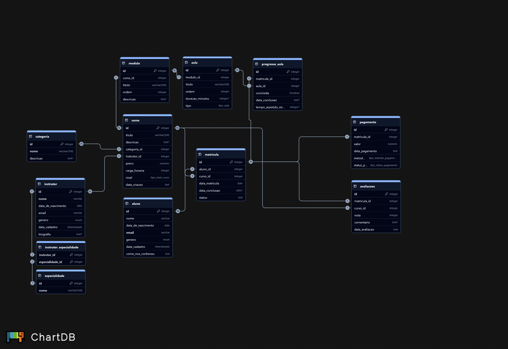

# 🎓 Projeto EduTech: Sistema de Gerenciamento de Cursos Online

**Autora:** Maria Clara Rodrigues  
**Data:** 17 de Outubro de 2025    
**Curso:** Desenvolvimento Full Stack - Casa Digital 2  

## 🧠 Contexto do Projeto

Este projeto documenta a modelagem e implementação da infraestrutura de dados para a **EduTech**, uma plataforma de cursos online fictícia. O objetivo foi criar um banco de dados relacional robusto e um pipeline de dados automatizado para popular o sistema, simulando um cenário de backend real com foco em domínio de SQL e boas práticas de arquitetura.

## ⚙️ Decisões de Modelagem e Arquitetura

Para garantir um banco de dados robusto e escalável, as seguintes decisões foram tomadas:

* **SGBD:** Foi escolhido o `PostgreSQL` por sua robustez, confiabilidade e recursos avançados.
* **Normalização:** O modelo segue a **3ª Forma Normal (3FN)** para reduzir redundâncias e garantir a integridade dos dados.
* **Chaves e Constraints:** Todas as tabelas possuem `chave primária` (`SERIAL` + `PRIMARY KEY`) e, quando aplicável, `chaves estrangeiras`. Foram aplicadas constraints importantes:
    * `NOT NULL` para campos obrigatórios.
    * `UNIQUE` para garantir que e-mails e outros campos não se repitam.
    * `CHECK` para validar valores permitidos (níveis de curso, status, etc.).
* **Tipos de Dados Otimizados:**
    * Tipos `ENUM` nativos do PostgreSQL foram usados para campos com valores predefinidos (`nivel`, `status`, etc.), melhorando a integridade e a performance.
    * Colunas de data/hora usam `TIMESTAMPTZ` para garantir consistência entre diferentes fusos horários, preparando a plataforma para uma base de usuários global.
* **Relações:** A relação Muitos-para-Muitos (N:N) entre `instrutor` e `especialidade` foi modelada com uma tabela de junção (`instrutor_especialidade`), seguindo as melhores práticas.

## 📋 Descrição das Tabelas

| Item / Conceito | Modelagem Base (Obrigatória) | Minha Modelagem (O que há de novo) | Justificativa da Mudança (O "Porquê") |
| :--- | :--- | :--- | :--- |
| **Relação Instrutor-Especialidade** | Apenas uma coluna `especialidade` (texto) na tabela `instrutores`. | Criação de uma tabela `especialidade` e uma tabela de junção `instrutor_especialidade` para uma relação **Muitos-para-Muitos (N:N)**. | O modelo base é inflexível, pois um instrutor só pode ter uma especialidade. Minha abordagem é **mais realista e escalável**, permitindo que um instrutor tenha múltiplas especialidades (ex: Python, SQL, Data Science) e padronizando os nomes para evitar erros. |
| **Lógica de Pagamento** | Coluna `valor_pago` diretamente na tabela `matriculas`. | Criação de uma tabela dedicada `pagamento`, com FK para `matricula_id`. | Separar pagamentos segue o **Princípio da Responsabilidade Única**. Permite rastrear detalhes cruciais que o modelo base ignora: **método de pagamento**, **status** (Aprovado, Recusado, Estornado), data exata da transação e histórico de pagamentos. |
| **Padronização de Dados (Status, Nível, etc.)** | Não especificado, implicando o uso de texto (`VARCHAR`). | Uso de tipos **`ENUM`** nativos do PostgreSQL para todos os campos com valores predefinidos (ex: `tipo_nivel_curso`, `tipo_status_matricula`). | Usar `ENUM` **previne erros de digitação**, melhora a performance de consultas e garante a integridade dos dados no nível do banco. É uma prática muito superior a usar texto livre. |
| **Gerenciamento de Datas e Fusos Horários** | Não especificado, implicando o uso de `DATE` ou `TIMESTAMP`. | Uso padronizado de **`TIMESTAMPTZ`** para todas as colunas que registram um momento no tempo. | O `TIMESTAMPTZ` armazena a informação de fuso horário. É uma **boa prática crucial para aplicações globais**, garantindo que a `data_cadastro` seja consistente para usuários no Brasil ou no Japão, evitando bugs complexos. |
| **Enriquecimento das Entidades** | Foco nos campos básicos para as entidades `aluno` e `instrutor`. | Adição de colunas como `genero` e `como_nos_conheceu`. | Adicionei campos extras para **simular um cenário de negócio mais realista**. `genero` permite uma comunicação mais personalizada e `como_nos_conheceu` é uma informação de marketing valiosíssima. |

## 🗄️ Schema Final do Banco de Dados

### Diagrama Entidade-Relacionamento (ERD)

O diagrama abaixo representa a estrutura final e as relações entre as tabelas do banco de dados.




### Script de Criação (schema.sql)

```sql
-- Script SQL final para criar a estrutura completa do banco de dados EduTech

-- Definição dos tipos ENUM para garantir a integridade dos dados.
CREATE TYPE tipo_fonte_conhecimento AS ENUM ('Redes Sociais', 'Anúncio Google', 'Indicação de amigos', 'Youtube', 'Outro');
CREATE TYPE tipo_nivel_curso AS ENUM ('iniciante', 'intermediario', 'avancado');
CREATE TYPE tipo_aula AS ENUM ('video', 'texto', 'quiz');
CREATE TYPE tipo_status_matricula AS ENUM ('ativa', 'concluida', 'cancelada', 'pendente');
CREATE TYPE tipo_metodo_pagamento AS ENUM ('Cartão de Crédito', 'Pix', 'Boleto');
CREATE TYPE tipo_status_pagamento AS ENUM ('Pendente', 'Aprovado', 'Recusado', 'Estornado');
CREATE TYPE tipo_genero AS ENUM ('Masculino', 'Feminino', 'Não Binário', 'Outros', 'Prefiro Não Informar');

-- Tabelas de Apoio e Referência
CREATE TABLE categoria ( id SERIAL PRIMARY KEY, nome VARCHAR(100) NOT NULL UNIQUE, descricao TEXT );
CREATE TABLE especialidade ( id SERIAL PRIMARY KEY, nome VARCHAR(100) NOT NULL UNIQUE );

-- Tabelas de Entidades Principais
CREATE TABLE aluno ( id SERIAL PRIMARY KEY, nome VARCHAR(100) NOT NULL, email VARCHAR(60) NOT NULL UNIQUE, genero tipo_genero, data_nascimento DATE, data_cadastro TIMESTAMPTZ NOT NULL DEFAULT NOW(), como_nos_conheceu tipo_fonte_conhecimento );
CREATE TABLE instrutor ( id SERIAL PRIMARY KEY, nome VARCHAR(100) NOT NULL, email VARCHAR(60) NOT NULL UNIQUE, genero tipo_genero, data_nascimento DATE, data_cadastro TIMESTAMPTZ NOT NULL DEFAULT NOW(), biografia TEXT );

-- Tabelas Centrais do Sistema
CREATE TABLE curso ( id SERIAL PRIMARY KEY, titulo VARCHAR(200) NOT NULL, descricao TEXT, categoria_id INT NOT NULL REFERENCES categoria(id), instrutor_id INT NOT NULL REFERENCES instrutor(id), preco NUMERIC(10, 2) NOT NULL CHECK (preco >= 0), carga_horaria INT NOT NULL CHECK (carga_horaria > 0), nivel tipo_nivel_curso NOT NULL, data_criacao TIMESTAMPTZ NOT NULL DEFAULT NOW() );
CREATE TABLE modulo ( id SERIAL PRIMARY KEY, curso_id INT NOT NULL REFERENCES curso(id), titulo VARCHAR(200) NOT NULL, ordem INT NOT NULL CHECK (ordem > 0), descricao TEXT );
CREATE TABLE aula ( id SERIAL PRIMARY KEY, modulo_id INT NOT NULL REFERENCES modulo(id), titulo VARCHAR(200) NOT NULL, ordem INT NOT NULL CHECK (ordem > 0), duracao_minutos INT CHECK (duracao_minutos > 0), tipo tipo_aula NOT NULL );

-- Tabelas de Ações e Detalhes
CREATE TABLE matricula ( id SERIAL PRIMARY KEY, aluno_id INT NOT NULL REFERENCES aluno(id), curso_id INT NOT NULL REFERENCES curso(id), data_matricula DATE NOT NULL DEFAULT CURRENT_DATE, data_conclusao DATE, status tipo_status_matricula NOT NULL, UNIQUE (aluno_id, curso_id) );
CREATE TABLE progresso_aula ( id SERIAL PRIMARY KEY, matricula_id INT NOT NULL REFERENCES matricula(id), aula_id INT NOT NULL REFERENCES aula(id), concluida BOOLEAN NOT NULL DEFAULT FALSE, data_conclusao TIMESTAMPTZ, tempo_assistido_minutos INT, UNIQUE (matricula_id, aula_id) );
CREATE TABLE pagamento ( id SERIAL PRIMARY KEY, matricula_id INT NOT NULL REFERENCES matricula(id), valor NUMERIC(10, 2) NOT NULL CHECK (valor >= 0), data_pagamento TIMESTAMPTZ NOT NULL DEFAULT NOW(), metodo_pagamento tipo_metodo_pagamento NOT NULL, status_pagamento tipo_status_pagamento NOT NULL );
CREATE TABLE avaliacoes ( id SERIAL PRIMARY KEY, matricula_id INT NOT NULL REFERENCES matricula(id), curso_id INT NOT NULL REFERENCES curso(id), nota INT NOT NULL CHECK (nota >= 1 AND nota <= 5), comentario TEXT, data_avaliacao TIMESTAMPTZ NOT NULL DEFAULT NOW(), UNIQUE (matricula_id, curso_id) );

-- Tabela de Junção
CREATE TABLE instrutor_especialidade ( instrutor_id INT NOT NULL REFERENCES instrutor(id), especialidade_id INT NOT NULL REFERENCES especialidade(id), PRIMARY KEY (instrutor_id, especialidade_id) );

```

🚀 Pipeline de Geração e Validação de Dados

Para popular o banco de dados com dados realistas e consistentes, foi criado um pipeline automatizado em Python. O fluxo é orquestrado pelo script main.py e executado com um único comando:

```bash
python python/main.py
```

## Fluxo de Trabalho: Geração → Validação → Limpeza

O processo segue 3 etapas seguras para garantir a qualidade dos dados:

    ⚙️ Etapa 1: Geração de Dados (gerador_dados.py)

        Usa a biblioteca Faker para criar dados fictícios (nomes, e-mails, etc.).

        Crucial: Adiciona IDs temporários em cada registro para garantir a consistência dos relacionamentos entre as tabelas.

        Exporta os dados brutos para a pasta data/ em formato CSV.

    🛡️ Etapa 2: Validação de Integridade (validador_csv.py)

        Lê os arquivos CSV e valida a integridade referencial entre eles.

        Exemplo: Verifica se o instrutor_id em um curso corresponde a um id de instrutor válido.

        Segurança: O processo é interrompido se qualquer inconsistência for encontrada, evitando a importação de dados corrompidos.

    ✨ Etapa 3: Limpeza e Preparação (main.py)

        Executado apenas se a validação for bem-sucedida.

        Remove as colunas de ID temporárias que serviram apenas para a montagem.

        O resultado final é um conjunto de arquivos CSV limpos e prontos para a importação direta no PostgreSQL, sem conflitos com as colunas SERIAL.

## ▶️ Como Executar o Projeto

### Pré-requisitos:

- PostgreSQL instalado e um banco de dados edutech_db criado.

- Python 3.9+ instalado.

- Instalar as dependências: `pip install pandas faker pytz`

### Passo a Passo:

- Setup do Banco de Dados:

- Execute o script `schema.sql` para criar a estrutura do banco.

- Execute o script `dados.sql` (se houver) para popular tabelas de apoio como categoria e especialidade.

- Executar o Pipeline de Dados:

No terminal, na pasta raiz do projeto (edutech), execute o comando: 

```
python python/main.py
```

### Passo a Passo:

- Setup do Banco de Dados:

    Execute o script `schema.sql` para criar a estrutura do banco.

    Execute o script `dados.sql` (se houver) para popular tabelas de apoio como categoria e especialidade.

- Executar o Pipeline de Dados:

    No terminal, na pasta raiz do projeto (edutech), execute o comando:
        Bash

    ```
    python python/main.py
    ```

#### Aguarde a conclusão. A pasta data/ conterá os arquivos CSV limpos.

- Importar os Dados no pgAdmin:

> Limpe as tabelas (se necessário) com o comando `TRUNCATE ... RESTART IDENTITY CASCADE;`.

> Importe cada arquivo CSV para a tabela correspondente, seguindo a ordem de dependência:

Grupo 1: As Fundações (Tabelas sem dependências externas) *Estas tabelas não dependem de nenhuma outra. Você pode importá-las em qualquer ordem dentro deste grupo.

    🧱 categoria.csv

    🧱 especialidade.csv

    🧱 aluno.csv

    🧱 instrutor.csv

Grupo 2: Primeiras Dependências (Dependem do Grupo 1) *Estas tabelas precisam que os dados do Grupo 1 já existam.  

    🏠 curso.csv (depende de categoria e instrutor)

    🏠 instrutor_especialidade.csv (depende de instrutor e especialidade)

Grupo 3: Dependências de Cursos 

    🚪 modulo.csv (depende de curso)


Grupo 4: Dependências de Módulos 8. 

    💡 aula.csv (depende de modulo)


Grupo 5: Ações e Eventos (Dependem de múltiplas tabelas já populadas) *Esta é a etapa final, que conecta tudo.*


    🛋️ matricula.csv (depende de aluno e curso) 

    🛋️ pagamento.csv (depende de matricula) 

    🛋️ progresso_aula.csv (depende de matricula e aula) 

    🛋️ avaliacoes.csv (depende de matricula e curso)


Nas configurações de importação, garanta que Header esteja ativado e `Encoding` seja `UTF-8`.

## 🏁 Conclusão e Resultados

#### O projeto foi concluído com sucesso, demonstrando um ciclo de vida de dados completo — da modelagem à geração, validação e preparação para importação.


### Apresentação de Slides

Para uma visão geral completa do projeto, incluindo a demonstração das consultas SQL e do pipeline, acesse a apresentação no Canva:

➡️ **[Acessar Slides da Apresentação do Projeto EduTech](https://www.canva.com/design/DAG2GjAi-Cw/eV7U_GQOQdGMlXymsvtIbg/view)**

